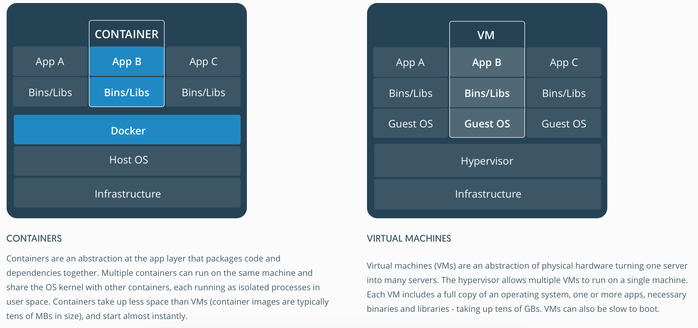

# Docker practicing
## What is "Docker"
An open platform where you can easier buildup, debug, maintain, and deliver your infrastructure/applications compared with traditional environment setup method. Docker setups a standardized environment that can be ran on different type of machine (This is of benefit because setting up an environment itselt can be tedious and tricky, which is a large obstacle for project development sometimes) 

## Architecture and common concept in docker

##### Image (映像檔) (R/O)
1. A read-only template with instructions for creating a docker container
2. Create Dockerfile with syntax (instruction) for the steps to create and run the image
3. Each instruction in a Dockerfile creates a layer in the image. Changing the Dockerfile and rebuild the image, only those layers which have changed are rebuilt.

##### Container (容器) (R/W)
1. A runnable instance created via image, and a loosely isolated environment to package and run your applications
2. You can create an run several containers from same or different image simultaneously --> Convenient and parallel
3. Lightweight and faster compared with virtual machines (VMs) because containers share the OS kernel with each other

4. Great for continuous integration and continuous delivery (CI/CD) workflows
5. Able to run on a developer's local laptop, on physical or virtual machines in a data center, on cloud providers, or in a mixture of environments --> Portable 
6. When a container is removed, any changes to its state that aren't stored in persistent storage disappear.

##### Docker daemon (Docker 常駐程式, `dockerd`)
1. Background executing program that does the heavy lifting of building, running, and distributing your Docker containers
2. Listens for Docker API requests and manages Docker objects such as images, containers, networks, and volumes
3. Docker client and daemon communicate using a REST API, over UNIX sockets or a network interface. 
4. Can run on the same system (local), or you can connect a Docker client to a remote Docker daemon (remote).

##### Docker client (`docker`)
1. Primary way to interact with Docker via `docker run` or `docker pull` ,etc.
2. Docker uses a client-server architecture, client can be you or Docker Compose (where you can work with a set of containers)
3. Comands will send to `dockerd` and operate

##### Docker registry
1. Similar to Github. Docker registry is a place you can store your images or seek others images
2. **Docker Hub** is the public and default registry
3. `docker pull` and `docker run` similar to `git clone` and running codes, and `docker push` similar to `git push` 

# Reference
https://docs.docker.com/get-started/docker-overview/
https://github.com/twtrubiks/docker-tutorial?tab=readme-ov-file
